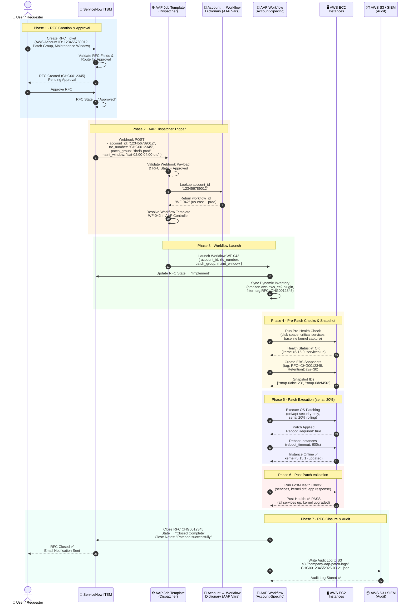
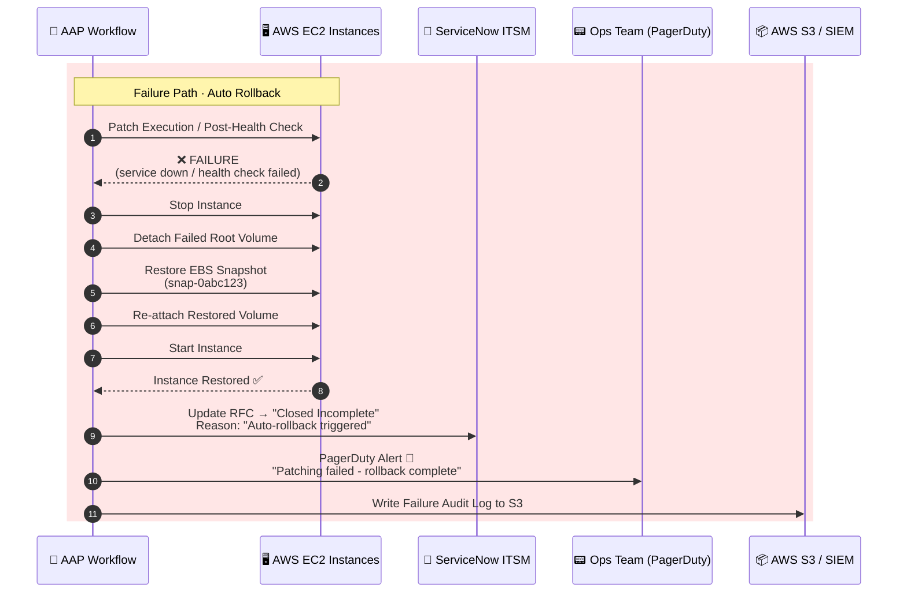

# Sequence Diagram: AAP Workflow for AWS RFC Patching

**Version:** 1.0 | **Date:** 2026-03-21 | **Status:** Draft

---

## Overview

This diagram shows the end-to-end flow when a user raises a ServiceNow RFC ticket for AWS account patching. The initial AAP Job Template acts as a **dispatcher** — it receives the AWS Account ID, looks it up in an internal dictionary, and triggers the account-specific AAP Workflow.

---

## Sequence Diagram



---

## Failure / Rollback Path



---

## Actor Reference

| Actor | Description |
|-------|-------------|
| **User / Requester** | Engineer or team requesting AWS account patching via ITSM |
| **ServiceNow ITSM** | RFC lifecycle management; sends approved RFC via webhook |
| **AAP Job Template (Dispatcher)** | Entry-point JT; validates payload and resolves workflow ID from dictionary |
| **Account → Workflow Dictionary** | AAP extra vars / custom credential storing `account_id → workflow_id` map |
| **AAP Workflow (Account-Specific)** | Per-account workflow handling inventory sync, health checks, patching, rollback |
| **AWS EC2 Instances** | Target patch hosts filtered by RFC tag via dynamic inventory |
| **AWS S3 / SIEM** | Audit log destination; receives structured JSON per patching run |

---

## Dictionary Structure (AAP Extra Variables)

```yaml
# AAP Job Template Extra Vars (or Custom Credential)
account_workflow_map:
  "111111111111": "WF-001"   # dev-account
  "222222222222": "WF-015"   # staging-us-east-1
  "333333333333": "WF-028"   # staging-us-west-2
  "123456789012": "WF-042"   # prod-us-east-1
  "987654321098": "WF-055"   # prod-us-west-2
  "555555555555": "WF-071"   # prod-eu-west-1
```

---

## Key Design Decisions

| # | Decision | Rationale |
|---|----------|-----------|
| 1 | Single dispatcher JT routes to account-specific workflows | Isolates blast radius; each account has tailored variables |
| 2 | Dictionary stored as AAP extra vars / credential | Avoids hardcoding; updatable without playbook changes |
| 3 | RFC approval checked before any AWS action | Enforces change control compliance |
| 4 | EBS snapshot taken before patching | Enables sub-30-min rollback without data loss |
| 5 | Serial patching at 20% | Prevents full fleet outage on failed patch |
| 6 | Post-health check gates RFC closure | RFC only closes on verified success |
